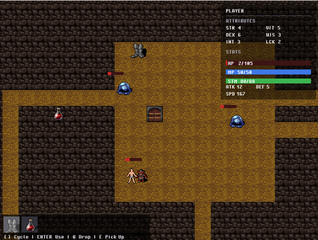

# GO-Quest



## Overview
GO Quest is a tile-based dungeon crawler written entirely in Go using the Ebiten 2D game engine.
It is both a game project and a learning playground for mastering Go through real-world patterns:

Composition over inheritance

Interfaces & plugin-style registries

Modular packages (player, items, enemies, atlas, dungeon, etc.)

Procedural generation

Pixel-based movement & smooth camera

Inventory systems, items, enemies, and basic combat

GO Quest is structured to make it easy to expand with new systems: maps, UI, AI, quests, combat, or procedural content.

## Building & Running
### Requirements

Go 1.21+ recommended
Ebiten (runtime is pure Go — nothing special to install)

## Git

### Run the game
```bash
git clone https://github.com/wirelessjava2002/go-quest
cd go-quest
go run .
```
### Build (desktop)
```bash
go build -o go-quest .
```
### Build (Android — using Ebitenmobile)
```bash
go install github.com/hajimehoshi/ebiten/v2/cmd/ebitenmobile@latest
ebitenmobile bind -target android -o goquest.aar ./cmd/go-quest
```

## Controls
Action	Key
Move	W A S D / Arrow Keys
Pick Up Item	E
Use Selected Item	Enter / Return
Drop Item	Q
Cycle Inventory Left	[
Cycle Inventory Right	]
Attack	Space
Quit (temporary)	Close window